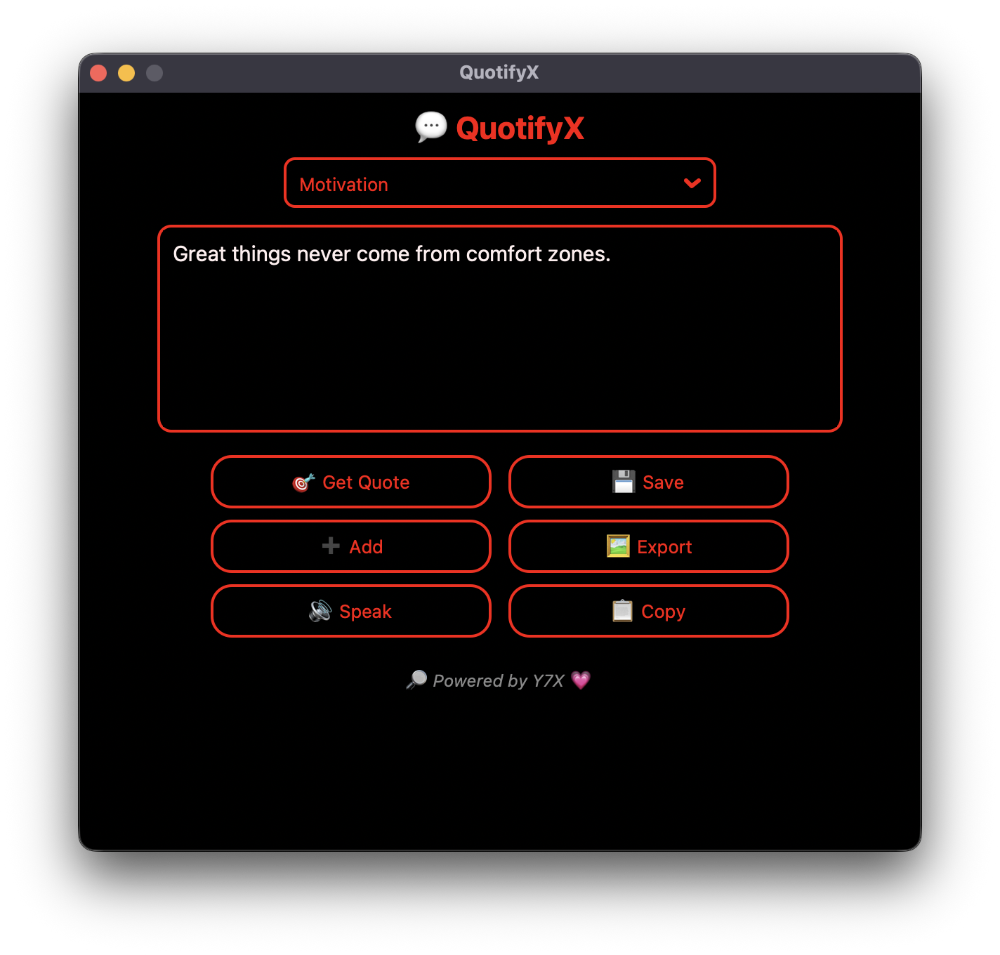

<h1 align="center">💬 QuotifyX</h1>
<p align="center">
  ⚡ A glowing AMOLED quote generator with speech, copy, save & export —<br>
  Designed with 💗 by <a href="https://github.com/Y7X-bit">Y7X</a>
</p>
<p align="center">
  
</p>


---

## ✨ Features

🎯 **Get Quotes** from multiple categories (Motivation, Funny, Productivity, API)  
🔊 **Text-to-Speech** with `pyttsx3`  
📋 **Copy to Clipboard**  
💾 **Save Favorites** to memory  
🖼️ **Export as Image**  
➕ **Add Custom Quotes**  
🖤 **Full AMOLED Theme** with **pitch red glow outlines**  
💗 **Made with love by Y7X**

---

## 🧠 Powered By

🔎 **QuotifyX** is proudly built by [Y7X-bit](https://github.com/Y7X-bit)  
With 🔥 redlines, 💡 quotes, and pure black pixels.

---

## 🚀 Tech Stack

- `Python`
- `customtkinter`
- `requests`
- `pyttsx3`
- `Pillow`
- `pyperclip`

---

## 📦 Requirements

```bash
pip install -r requirements.txt